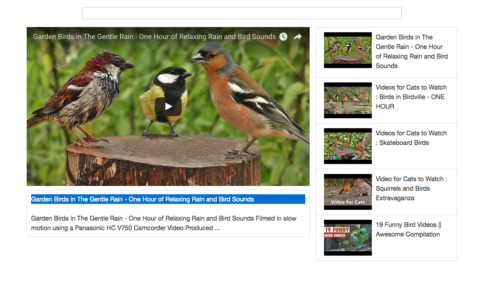

# Youtube search Engine

Interested in learning [Redux](https://www.udemy.com/react-redux/)?

### Getting Started

 Here are the steps for runing the app on your machine:
```
> git clone
> cd into directory
> npm install
> npm start
```
 ###  Youtube search engine :

 * project is build using ReactJs
 * I used the Api from youtube to display the videos on the UI
 * I used lodash to delay the search input with 300 ms
 * project is structured in several components and the code is nice and clean
 * the app is faster than the proper youtube chanel :D :D


 
